#  PWA Beers - Step 00 - Anatomy of a Progressive Web App with Polymer

This is the initial step of the tutorial. In this step you won't need to code, everything is already coded for you.

In order to see a PWA in action and understand the features that make its *progressiveness*, you're going to generate a sample PWA using Polymer CLI, serve it and see it in action in your browser.

> If you don't have Polymer CLI installed, don't panic. You simple get the `shop-app.zip` resources file and you expand it in the `pwa-example` folder. Then you go to the [Testing the Shop app](testing-the-shop-app) section


## Generating the Shop app

You're going to use the Polymer CLI to install the PWA sample app: the [Shop app](https://shop.polymer-project.org/).

Go to the `/example-pwa` folder and run `polymer init`. Then choose the shop app as the template.

```bash
$ polymer init
```

 [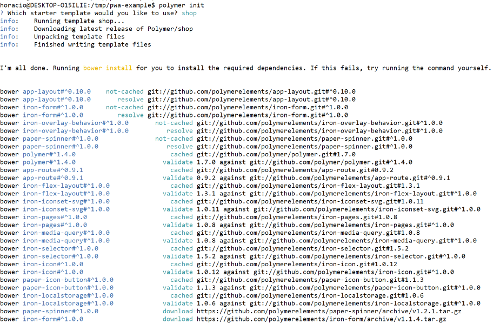](../img/polymer-cli-00.png)


## Building the Shop app

You're going to use the Polymer CLI to build the Shop app you've just generated.

```bash
$ polymer build
```

This `build` command  generates two builds, a *bundled* one where resources are grouped according to the fragments described on the `polymer.json` file, and an *unboundled* one where each element remains in it's own file. If you're using HTTP 1.x, you should serve the bundled version, and if you're using an HTTP2 server, then go for the unbundled.


## Testing the Shop app

In order to test the built PWA, launch your web server at `/pwa-example/build/bundled` and go with your browser to `http://localhost:8080/`.

Here the app in a wide screen laptop:

 [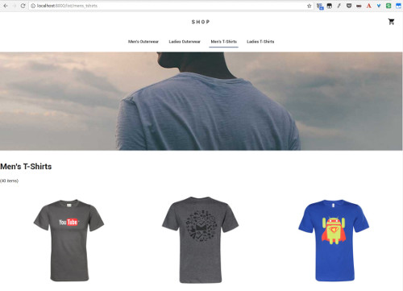](../img/shop-app-00.jpg)

And here the app in a smartphone:

 [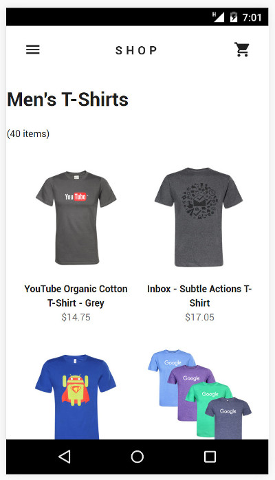](../img/shop-app-01.jpg)

Then you can go to the `Application` tab on Chrome Developer Tools. On this tab you have details on many of the *progressive* capabilities of your app:

- The Manifest, whether it's valid or not, and info about its contents
- The Service Worker, whether it's installed and/or running or not
- The offline storage (local storage, IndexedDb, WebSQL...)

 [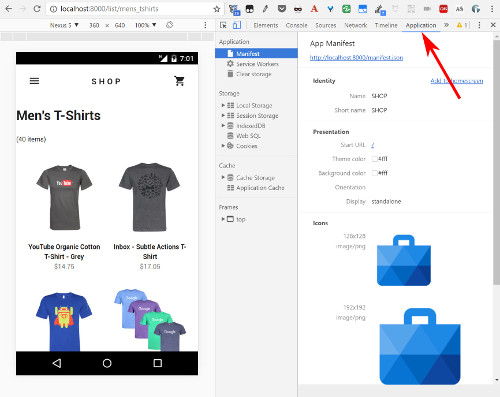](../img/shop-app-02.jpg)

You won't be able to easily test the application on your phone, as Service Workers asks for an HTTPS server. But you can go to the [official deployed version](https://shop.polymer-project.org/) of the app and test it now.

Now let's understand a bit how does it work:


## App structure

The Shop app is made up of several main views: the home view, list view, detail view, and shopping cart view:

 [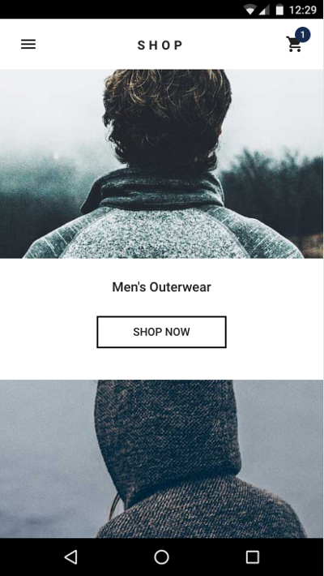](../img/shop-home.png)
 [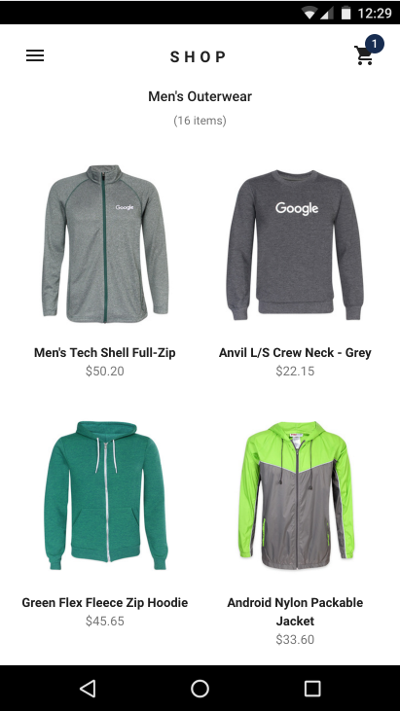](../img/shop-browse.png)
 [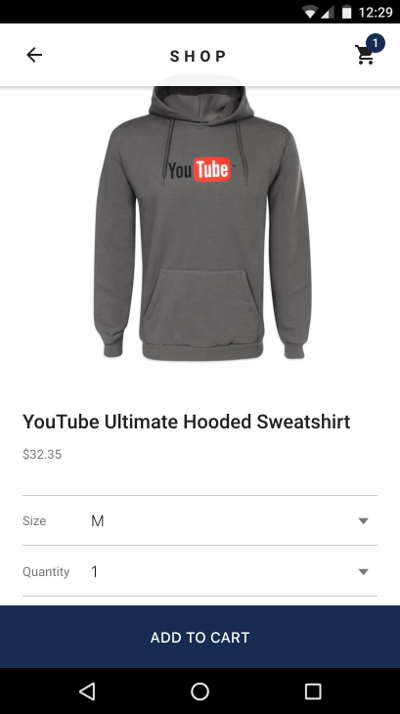](../img/shop-detail.png)
 [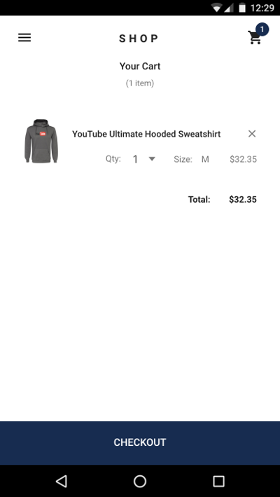](../img/shop-cart.png)

The app uses custom elements as its organizing principle: A top-level application element serves as the main controller for the app. App-specific elements build views, such as the browse and detail views. The stores for user and product data are also implemented as elements. These elements are in turn composed of reusable elements, like buttons and tabs. Reusable elements also supply other essential functions, including overall layout and routing. The [`<iron-pages>`](https://elements.polymer-project.org/elements/iron-pages) element controls which view is currently visible.


 [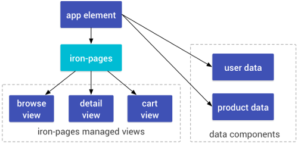](../img/shop-high-level-arch.png)


## Routing

Shop's client-side URL routing is based on the [`<app-route>`](https://elements.polymer-project.org/elements/app-route) element, a modular routing element. The app element has a top-level `<app-route>` element that's bound to the page URL, and selects the top-level view by setting the app element's page property.

The top-level element delegates the remainder of the route to other instances of `<app-route>` that represent sub-routes. For example, when browsing a category, the top-level `<app-route>`selects the browse view, and the second-level `<app-route>` selects the category to show.

All navigation is accomplished with links (`<a>` tags) (which ensures that the app can be indexed by web crawlers). The routing elements handle the URL changes and pass route data to the active view element.

For example, the path `/list/Shoes` displays the browse (list) view, and passes the category "Shoes" to the browse view.

More information:

[Encapsulated routing with elements](https://www.polymer-project.org/1.0/blog/routing)
[`<app-route>` API reference](https://elements.polymer-project.org/elements/app-route)

## Views

The main views of the element are controlled by an [`<iron-pages>`](https://elements.polymer-project.org/elements/iron/pages) element, which displays a single view at a time. When a view is active, it takes over the whole content area below the app header.

The `<iron-pages>` element is bound to the app element's page property, which is in turn set based on the current route. The view switching code looks like this:

shop-app.html
```HTML
<iron-pages role="main" selected="[[page]]" attr-for-selected="name" selected-attribute="visible">
  <!-- home view -->
  <shop-home name="home" categories="[[categories]]"></shop-home>
  <!-- list view of items in a category -->
  <shop-list name="list" route="[[subroute]]" offline="[[offline]]"></shop-list>
  <!-- detail view of one item -->
  <shop-detail name="detail" route="[[subroute]]" offline="[[offline]]"></shop-detail>
  <!-- cart view -->
  <shop-cart name="cart" cart="[[cart]]" total="[[total]]"></shop-cart>
  <!-- checkout view -->
  <shop-checkout name="checkout" cart="[[cart]]" total="[[total]]" route="{{subroute}}"></shop-checkout>
</iron-pages>
```

When the `page` property is list, the `list` or browse view is active.

The views are created lazily on demand by taking advantage of the custom element's upgrade feature. The inactive view elements (such as `shop-list` above) exist in the DOM as instances of `HTMLElement`.

When you change pages, the application loads the definition for the active view. When the definition loads, the browser upgrades the element to a fully-functional custom element.

```JS
_pageChanged: function(page, oldPage) {
  if (page != null) {
    // home route is eagerly loaded
    if (page == 'home') {
      this._pageLoaded(Boolean(oldPage));
    // other routes are lazy loaded
    } else {
      this.importHref(
        this.resolveUrl('shop-' + page + '.html'),
        function() {
          this._pageLoaded(Boolean(oldPage));
        }, null, true);
    }
  }
},
```

In the logic above, the home view is built into the app shell, but the other views are demand-loaded fragments.

Shop also uses `dom-if` templates to lazily create views:

```HTML
<div id="tabContainer" primary$="[[_shouldShowTabs]]" hidden$="[[!_shouldShowTabs]]">
  <template is="dom-if" if="[[_shouldRenderTabs]]">
    <shop-tabs
        selected="[[categoryName]]"
        attr-for-selected="name">
      <template is="dom-repeat" items="[[categories]]" as="category" initial-count="4">
        <shop-tab name="[[category.name]]">
          <a href="/list/[[category.name]]">[[category.title]]</a>
        </shop-tab>
      </template>
    </shop-tabs>
  </template>
```

When parsed, the template's content is inert, and not included in the main document. If the `_shouldRenderTabs` property is true, the template's contents are inserted into the DOM, the elements are initialized and their local DOM trees created. Since the tabs are only displayed on desktop, mobile users never pay the cost to create elements they're not using.

##Theming

Shop uses [CSS custom properties](https://www.polymer-project.org/1.0/docs/devguide/styling#custom-css-properties) and [mixins](https://www.polymer-project.org/1.0/docs/devguide/styling#custom-css-mixins) for theming both its application-specific elements and the reusable elements it includes.

Shop defines a few, top-level custom properties to set basic theme colors, which are passed down to other elements.

```CSS
:host {
  --app-primary-color: #0b374b;
  --app-secondary-color: #fee0e0;
  --app-accent-color: #202020;
    ...
}
```

These custom properties are special CSS properties defined by the component author. The Shop app uses these three properties to define its theme colors. These values can be used inside other CSS rules using the `var()` function:

```CSS
  color: var(--app-accent-color);
```

Custom properties can also be used to set other custom properties.

```CSS
  --paper-button-ink-color: var(--app-primary-color);
  --paper-icon-button-ink-color: var(--app-primary-color);
  --paper-spinner-color: var(--app-primary-color);
```

Here, the app's theme colors are passed down to several of the reusable elements from the paper elements set.

If you add more elements to the app, you can find the custom properties for those elements in the element API doc. (For example, in the example above, --app-primary-color is used to set the `<paper-button>` ink color, as documented in the `<paper-button>` [API docs](https://elements.polymer-project.org/elements/paper-button#styling).

For more on custom properties and mixins, see the [Polymer docs](https://www.polymer-project.org/1.0/docs/devguide/styling#xscope-styling-details). Polymer provides a *shim* for custom properties, but there are a number of limitations to the shim, especially around dynamic changes to property values. If you want to do anything fancy with custom properties, read up on the [*shim* limitations](https://www.polymer-project.org/1.0/docs/devguide/styling#custom-properties-shim-limitations) and the [custom style API](https://www.polymer-project.org/1.0/docs/devguide/styling.html#style-api).

## Offline caching

To provide a better experience in offline and spotty network situations, Shop uses service worker to provide offline caching for its "app shell"—that is, the app's UI and business logic. A service worker is a script associated with a specific web site that acts as a client-side proxy for network requests. The service worker can intercept network requests and access the browser's cache.

The first time someone opens the site, the browser installs the site's service worker, and the service worker ensures that the site's app shell is cached for offline use. On subsequent visits, the service worker can load the app shell directly from the cache. If the user is completely offline, the service worker can still load the app shell, and display cached data or an offline message, as appropriate.

Shop uses the `sw-precache` [library](https://github.com/GoogleChrome/sw-precache) for offline support. This library takes a list of files to cache and generates a service worker at build time, so you don't need to write your own service worker code. Just create a list of the essential resources and add the precache script to your build process. The [Polymer CLI](https://github.com/polymer/polymer-cli) supports [this use-case using sw-precache for generating a service worker](https://github.com/polymer/polymer-cli#app-shell-structure) to cache the dependencies for your application's "shell".

## Application layout using app-layout

The app layout elements provide a responsive layout for the Shop. The elements are modular building blocks designed to be composed together to create different layouts. The main UI component across the app is an `<app-header>` that contains the title and main navigation controls. The `<app-header>` holds `<app-toolbars>`, which are horizontal containers for controls. One toolbar contains the title and buttons.

On desktop, the browse view uses a second toolbar, with a set of navigation tabs. As you scroll down the page, the header condenses and scrolls away. Scrolling up the page at any point reveals the tabs.


 [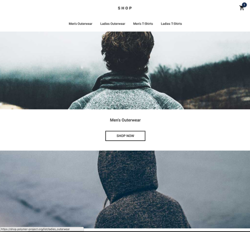](../img/shop-toolbar-expanded.png)
 [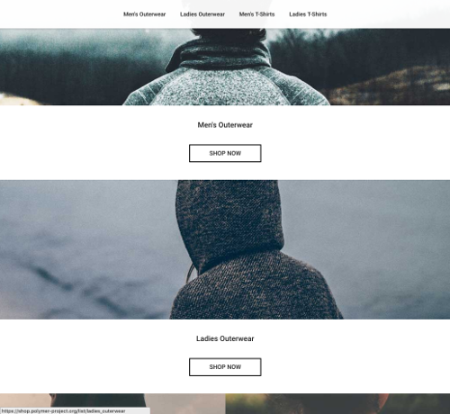](../img/shop-toolbar-condensed.png)

The tabs don't work as well on mobile devices, so Shop uses an <app-drawer> element as a navigation drawer, with a vertical menu.


 [](../img/shop-home.png)
 [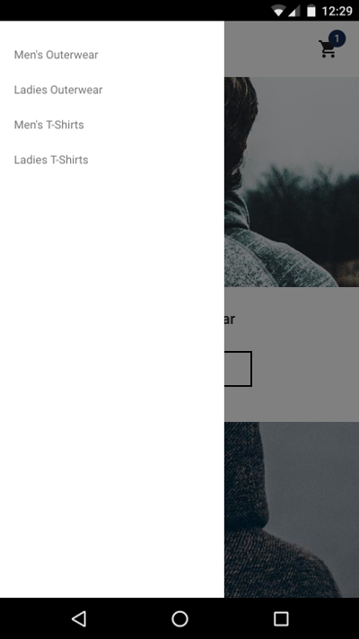](../img/shop-drawer.png)

The app layout element set also includes simple container elements for positioning headers and drawers: the `<app-header-layout>` and `<app-drawer-layout>` elements.


## Next

Now you've seem a PWA with Polymer it's time to go to [step-01](../step-01/) and begin coding yours!
