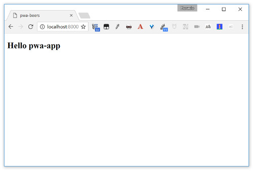

#  PWA Beers - Step 01 - An empty application

After the precedent step, this one is going to be easy: you're going to generate and explore an empty app with Polymer.

> As in the precedent case, if you don't have Polymer CLI installed, don't panic. You simple getuncompress the `empty-app.zip` file into the `app` folder and copy the content of `bower_components` folder inside `step-01/bower_components`.
>
> You can then directly go to the [Explore your app](explore-your-app) section.


## Generating the empty app

You're going to use the Polymer CLI to generate an empty application. Go to the `/app` folder and run `polymer init`. Then choose the blank application template, and call your app `pwa-beers`.

```bash
$ polymer init
? Which starter template would you like to use?
  element - A blank element template
❯ application - A blank application template
  shop - The "Shop" Progressive Web App demo
  starter-kit - A starter application template, with navigation and "PRPL pattern" loading
info:    Running template application...
? Application name pwa-beers
? Main element name pwa-app
? Brief description of the application A tutorial on PWA with Polymer 1.x
   create bower.json
   create index.html
   create manifest.json
   create README.md
   create src/pwa-app/pwa-app.html
   create test/pwa-app/pwa-app_test.html

Project generated!
Installing dependencies...

I´m all done. Running bower install for you to install the required dependencies. If this fails, try running the command yourself.


bower webcomponentsjs#^0.7.0       not-cached https://github.com/webcomponents/webcomponentsjs.git#^0.7.0
bower webcomponentsjs#^0.7.0          resolve https://github.com/webcomponents/webcomponentsjs.git#^0.7.0
[...]
bower iron-validatable-behavior#^1.0.0               install iron-validatable-behavior#1.1.1
bower iron-form-element-behavior#^1.0.0              install iron-form-element-behavior#1.0.6

iron-component-page#1.1.8 bower_components/iron-component-page
├── hydrolysis#1.24.1
├── iron-ajax#1.4.3
├── iron-doc-viewer#1.1.0
├── iron-flex-layout#1.3.1
├── iron-icons#1.2.0
├── iron-selector#1.5.2
├── paper-header-panel#1.1.7
├── paper-styles#1.1.5
├── paper-toolbar#1.1.7
└── polymer#1.7.1

[...]

iron-form-element-behavior#1.0.6 bower_components/iron-form-element-behavior
└── polymer#1.7.1

Setup Complete!
Check out your new project README for information about what to do next.
```

## Explore your app

Now launch `polymer serve` (or your webserver) in order to test the empty application. Point your browser to your local serve (http://localhost:8080 when using `polyserve`) and you see... a nice empty page.

[](../img/empty-app.jpg)

On `index.html`:
```HTML
<!doctype html>
<html lang="en">
  <head>
    <meta charset="utf-8">
    <meta name="viewport" content="width=device-width, minimum-scale=1, initial-scale=1, user-scalable=yes">

    <title>pwa-beers</title>
    <meta name="description" content="pwa-beers description">

    <!-- See https://goo.gl/OOhYW5 -->
    <link rel="manifest" href="/manifest.json">

    <script src="/bower_components/webcomponentsjs/webcomponents-lite.js"></script>

    <link rel="import" href="./src/pwa-app/pwa-app.html">
  </head>
  <body>
    <pwa-app></pwa-app>
  </body>
</html>
```

As you can see, `index.html` is a simple shell loading web components polyfill and importing your main element, `<pwa-app>`.
Right now it doesn't do lots of things... but we are going to do something about that right now.

On `src/pwa-app/pwa-app.html`:
```HTML
<link rel="import" href="/bower_components/polymer/polymer.html">

<dom-module id="pwa-app">
  <template>
    <style>
      :host {
        display: block;
      }
    </style>
    <h2>Hello [[prop1]]</h2>
  </template>

  <script>
    Polymer({

      is: 'pwa-app',

      properties: {
        prop1: {
          type: String,
          value: 'pwa-app',
        },
      },

    });
  </script>
</dom-module>
```

## Add some routing

Now we are going to add routing to our empty app. We begin by adding `app-route` to your dependencies:

On `bower.json`:
```json
{
  "name": "pwa-beers",
  "description": "A tutorial on PWA with Polymer 1.x",
  "main": "index.html",
  "dependencies": {
    "app-route": "PolymerElements/app-route#^0.9.3",
    "polymer": "Polymer/polymer#^1.4.0"
  },
  "devDependencies": {
    "iron-component-page": "PolymerElements/iron-component-page#^1.0.0",
    "iron-demo-helpers": "PolymerElements/iron-demo-helpers#^1.0.0",
    "web-component-tester": "^4.0.0",
    "webcomponentsjs": "webcomponents/webcomponentsjs#^0.7.0"
  }
}
```

And then making a `bower install` again.

Now we import the `<app-route>` and `<app-location>` elements inside our `pwa-app` element:

On `src/pwa-app/pwa-app.html`:
```HTML
<link rel="import" href="/bower_components/app-route/app-location.html">
<link rel="import" href="/bower_components/app-route/app-route.html">
```

And then we instantiate them in the template part of the element:

On `src/pwa-app/pwa-app.html`:
```HTML
<app-location route="{{route}}" use-hash-as-path></app-location>
<app-route route="{{route}}" pattern="/:page" data="{{routeData}}" tail="{{subroute}}"></app-route>
```

Now the field `page` from the `routeData` property will change when the fragment of the URL (the part after the `#`) changes, keeping the value of the first path element in the URL fragment.

As `page` is a subproperty of a property, Polymer 1.x doesn't track its changes (Polymer 2.0 will do it, and you won't need this kind of hack). We are going to declare an explicit observer to track its value, and then, if we have no route, we are going to point the browser to the `#/main` route

On `src/pwa-app/pwa-app.html`:
```JS
observers: [
  '_routePageChanged(routeData.page)',
],
// *********************************************************************
// Observers
// *********************************************************************

_routePageChanged: function(page) {
  console.debug("[pwa-app] _routePageChanged", page);
  if (!page) {
    window.history.replaceState({}, null, "#/main");
    window.dispatchEvent(new CustomEvent('location-changed'));
    return;
  }
  this.page = page;
},
```

Now you have a working routing system. We are going to create to * pages* for your app now.


## Adding two *pages*

Let's begin again by adding the dependencies for `iron-pages` and  `iron-selector` to the `bower.json`:

On `bower.json`:
```json
{
  "name": "pwa-beers",
  "description": "A tutorial on PWA with Polymer 1.x",
  "main": "index.html",
  "dependencies": {
    "polymer": "Polymer/polymer#^1.4.0",
    "app-route": "PolymerElements/app-route#^0.9.3",
    "iron-pages": "PolymerElements/iron-pages#^1.0.8",
    "iron-selector": "PolymerElements/iron-selector#^1.5.2"
  },
  "devDependencies": {
    "iron-component-page": "PolymerElements/iron-component-page#^1.0.0",
    "iron-demo-helpers": "PolymerElements/iron-demo-helpers#^1.0.0",
    "web-component-tester": "^4.0.0",
    "webcomponentsjs": "webcomponents/webcomponentsjs#^0.7.0"
  }
}
```

And, after yet another `bower install`, import both components into `pwa-app`:

On `src/pwa-app/pwa-app.html`:
```HTML
<link rel="import" href="/bower_components/iron-pages/iron-pages.html">
```

And now, add an `<iron-pages` components that allows you to select what children component to show.
`<iron-pages>` will look to the value of its  `selected` property and look at its children elements,
searching one with the attribute defined by `attr-for-selected` (`name` in our case) and show it.

If no element match, it will use the  `fallback-selection` value.

```HTML
<iron-pages selected="[[page]]" attr-for-selected="name" fallback-selection="lost">
  <div name="main"><h1>Beer list</h1></div>
  <div name="bye"><h1>Beer details</h1></div>
  <div name="lost"><h1>It`s seem I'm lost...</h1></div>
</iron-pages>
```

Now test it by going to `http://localhost:8080/`, `http://localhost:8080/#/main`,  `http://localhost:8080/#/bye`,  `http://localhost:8080/#/wtf` (supposing that your server is set to listen port 8080, of course).


## To go deeper

### Create and use three empty elements

As a last exercise, we proprose you to replace the three *divs* inside the `<iron-pages>` by three custom elements: `<pwa-main>`, `<pwa-bye>` and `<pwa-lost>` that you're goint to create in an `elements` folder inside `app`.

And then, play a bit with your element, add some text, images, CSS, make yourself a bit at home with Polymer.

## Next

After this step you have a working web application with Polymer. Now you're going to create your first element, the beer list, in the [step-02](../step-02/) and begin coding yours!
