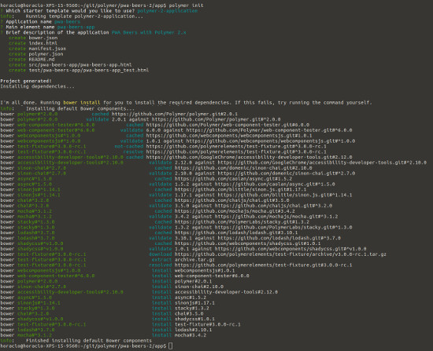

#  PWA Beers - Step 01 - An empty application

This first step is an easy one: you're going to generate and explore an empty app with Polymer.

> If you don't have Polymer CLI installed, don't panic. You can simply uncompress the `empty-app.zip` file into the `app` folder. Then you can directly go to the [Explore your app](explore-your-app) section.


## Generating the empty app

You're going to use the Polymer CLI to generate an empty application. Go to the `/app` folder and run `polymer init`. Then choose the blank Polymer 2 application template, and choose `pwa-beers` as app name.


[](../img/step-01_01.jpg)


## Explore your app

Now launch `polymer serve` (or your webserver) in order to test the empty application. Point your browser to your local serve (usually http://localhost:8081 when using `polymer serve`) and you see... a nice empty page.

[](../img/empty-app.jpg)

On `index.html`:

```HTML
<!doctype html>
<html lang="en">
  <head>
    <meta charset="utf-8">
    <meta name="viewport" content="width=device-width, minimum-scale=1, initial-scale=1, user-scalable=yes">

    <title>pwa-beers</title>
    <meta name="description" content="PWA Beers with Polymer 2.x">

    <!-- See https://goo.gl/OOhYW5 -->
    <link rel="manifest" href="/manifest.json">

    <script src="/bower_components/webcomponentsjs/webcomponents-loader.js"></script>

    <link rel="import" href="/src/pwa-beers-app/pwa-beers-app.html">
  </head>
  <body>
    <pwa-beers-app></pwa-beers-app>
  </body>
</html>

```

In order to make the application independent of location, we are changing all absolute links to relative ones :

```HTML
<link rel="manifest" href="./manifest.json">

<script src="./bower_components/webcomponentsjs/webcomponents-loader.js"></script>

<link rel="import" href="./src/pwa-beers-app/pwa-beers-app.html">
```    

As you can see, `index.html` is a simple shell loading web components polyfill and importing your main element, `<pwa-beers-app>`.

Right now this `pwa-beers-app` is a very simple Polymer 2 element:

On `src/pwa-beers-app/pwa-beers-app.html`:

```HTML
<link rel="import" href="../../bower_components/polymer/polymer-element.html">

<dom-module id="pwa-beers-app">
  <template>
    <style>
      :host {
        display: block;
      }
    </style>
    <h2>Hello [[prop1]]!</h2>
  </template>

  <script>
    /**
     * @customElement
     * @polymer
     */
    class PwaBeersApp extends Polymer.Element {
      static get is() { return 'pwa-beers-app'; }
      static get properties() {
        return {
          prop1: {
            type: String,
            value: 'pwa-beers-app'
          }
        };
      }
    }

    window.customElements.define(PwaBeersApp.is, PwaBeersApp);
  </script>
</dom-module>
```

We are going to play with it to give it some nice features as routing...

## Add some routing

Now we are going to add routing to our empty app. We begin by adding `app-route` to our dependencies:

```bash
bower install --save PolymerElements/app-route
```

It install the dependency and puts it in the `bower.json`:

```json
{
  "name": "pwa-beers",
  "description": "PWA Beers with Polymer 2.x",
  "main": "index.html",
  "dependencies": {
    "polymer": "Polymer/polymer#^2.0.0",
    "app-route": "PolymerElements/app-route#^2.0.0"
  },
  "devDependencies": {
    "web-component-tester": "Polymer/web-component-tester#^6.0.0",
    "webcomponentsjs": "webcomponents/webcomponentsjs#^1.0.0"
  }
}
```


Now we import the `<app-route>` and `<app-location>` elements inside our `pwa-app` element:

On `src/pwa-beers-app/pwa-beers-app.html`:

```HTML
<link rel="import" href="../../bower_components/app-route/app-location.html">
<link rel="import" href="../../bower_components/app-route/app-route.html">
```

And then we instantiate them in the template part of the element:

On `src/pwa-beers-app/pwa-beers-app.html`:

```HTML
<app-location route="{{route}}" use-hash-as-path></app-location>
<app-route route="{{route}}" pattern="/:page" data="{{routeData}}" tail="{{subroute}}"></app-route>

<h2>Current page: [[routeData.page]]</h2>
```

Now the field `page` from the `routeData` property will change when the fragment of the URL (the part after the `#`) changes, keeping the value of the first path element in the URL fragment. And we will see these changes in the screen with the one-way data binding notation `[[routeData.page]]`.

As `routeData.page` is a subproperty of a property, we are going to declare an explicit observer to track its value, and then, if we have no route, we are going to point the browser to the `#/list` route. 

On `src/pwa-app/pwa-app.html`:
```JS
static get observers() {
  return [
    '_routePageChanged(routeData.page)'
  ]
}

_routePageChanged(page) {
  console.log('[pwa-beers-app] _routePageChanged', page);
  if (!page) {
    window.history.replaceState({}, null, "#/list");
    window.dispatchEvent(new CustomEvent('location-changed'));
    return;
  }
  this.page = page;
}
```

We also create a `page` property in the element that will hold the current page.

```JS
static get properties() {
  return {
    page: {
      type: String,
    }
  };
}
```      

Now you have a working routing system. We are going to create two *pages* for your app now, one for the beer list, another for beer details.


## Adding two *pages*

Let's begin again by adding the dependency for `iron-pages`:

```
bower install --save PolymerElements/iron-pages PolymerElements/iron-selector 
```

And we get the dependencies added to the `bower.json`:

On `bower.json`:
```json
{
  "name": "pwa-beers",
  "description": "PWA Beers with Polymer 2.x",
  "main": "index.html",
  "dependencies": {
    "polymer": "Polymer/polymer#^2.0.0",
    "app-route": "PolymerElements/app-route#^2.0.0",
    "iron-pages": "PolymerElements/iron-pages#^2.0.0",
  },
  "devDependencies": {
    "web-component-tester": "Polymer/web-component-tester#^6.0.0",
    "webcomponentsjs": "webcomponents/webcomponentsjs#^1.0.0"
  }
}
```

After installing the dependency, import the element into `pwa-app`:

On `src/pwa-beers-app/pwa-beers-app.html`:

```HTML
<link rel="import" href="../../bower_components/iron-pages/iron-pages.html">
```

And now, add an `<iron-pages` components that allows you to select what children component to show.
`<iron-pages>` will look to the value of its  `selected` property and look at its children elements,
searching one with the attribute defined by `attr-for-selected` (`name` in our case) and show it.

If no element match, it will use the  `fallback-selection` value.

```HTML
<iron-pages selected="[[page]]" attr-for-selected="name" fallback-selection="lost">
  <div name="list"><h1>Beer list</h1></div>
  <div name="details"><h1>Beer details</h1></div>
  <div name="lost"><h1>It`s seem I'm lost...</h1></div>
</iron-pages>
```

Now test it by going to `http://localhost:8081/`, `http://localhost:8081/#/list`,  `http://localhost:8081/#/details`,  `http://localhost:8081/#/wtf`.

## Next

After this step you have a working web application with Polymer. Now you're going to create your first element, a very simple custom `beer-list-item`, in the [step-02](../step-02/) and begin coding yours!
