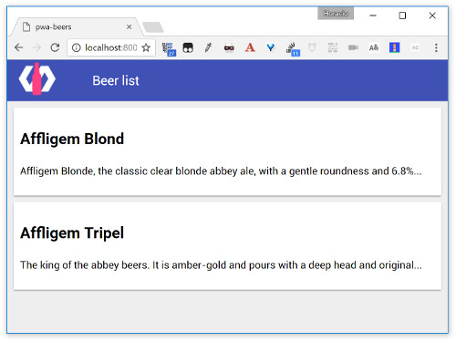

#  PWA Beers - Step 02 - Beer list element

In this step we are going to use our first Polymer element, a very simple custom `beer-list-item`.
By using it you will see how easily you can add Polymer widgets to your normal web applications.

## Material design

We are going to give a [Material Design](https://material.io/guidelines/) look to our application, by using some of the Polymer [Paper Elements](https://elements.polymer-project.org/browse?package=paper-elements). We will be using [`paper-toolbar`](https://elements.polymer-project.org/elements/paper-toolbar) to add a main toolbar to the application, and [`paper-material`](https://elements.polymer-project.org/elements/paper-material) to add a paper card for each beer.

We begin by adding `paper-toolbar` and `paper-material` to our dependencies:

On `bower.json`:
```json
{
  "name": "pwa-beers",
  "description": "A tutorial on PWA with Polymer 1.x",
  "main": "index.html",
  "dependencies": {
    "polymer": "Polymer/polymer#^1.4.0",
    "app-route": "PolymerElements/app-route#^0.9.3",
    "iron-pages": "PolymerElements/iron-pages#^1.0.8",
    "iron-selector": "PolymerElements/iron-selector#^1.5.2",
    "paper-toolbar": "PolymerElements/paper-toolbar#^1.1.7",
    "paper-material": "PolymerElements/paper-material#^1.0.6"
  },
  "devDependencies": {
    "iron-component-page": "PolymerElements/iron-component-page#^1.0.0",
    "iron-demo-helpers": "PolymerElements/iron-demo-helpers#^1.0.0",
    "web-component-tester": "^4.0.0",
    "webcomponentsjs": "webcomponents/webcomponentsjs#^0.7.0"
  }
}
```

And in `./src/pwa-main/pwa-main.html` we import `paper-toolbar` :

```HTML
<link rel="import" href="/bower_components/paper-toolbar/paper-toolbar.html">
```

and then we replace the `h1` tags inside `iron-pages` by a `paper-toolbar`:

```HTML
<iron-pages selected="[[page]]" attr-for-selected="name" fallback-selection="lost">
  <div name="list">
    <paper-toolbar>
      <div class="logo"></div>
      <div class="title">Beer list</div>
    </paper-toolbar>
  </div>
  <div name="details"><h1>Beer details</h1></div>
  <div name="lost"><h1>It`s seem I'm lost...</h1></div>
```


## The custom element

We are adding a custom `beer-list-item` Polymer element that will be stored in the `src/beer-list` folder.

A Polymer element definition is composed of two parts inside a `dom-model` declaration:

* A  `template` defining the local DOM for the element and the CSS rules that apply to this local DOM.

* A `Polymer` element registration linking the `dom-model` and it's behavior and making it available to the application.

You will get (lots of) more details on custom element definition on further steps, by now this should be enough.

Our custom element is very simple at this step:


```html
<!-- Import Polymer library -->
<link rel="import" href="/bower_components/polymer/polymer.html">
<!-- Import paper-material -->
<link rel="import" href="/bower_components/paper-material/paper-material.html">


<dom-module id="beer-list-item">
  <template>
    <style>
      .beer {
        margin: 10px;
        padding: 10px;
        background-color: white;
        min-height: 50px;
      }
    </style>
    <paper-material class="beer">
      <h2>{{name}}</h2>
      <p>{{description}}</p>
    </paper-material>
  </template>
  <script>
    Polymer({
      is: 'beer-list-item',

      properties: {
        name: String,
        description: {
          type: String,
          value: ""
        }
      }
    })
  </script>
</dom-module>
```

## Add the `beer-list-item` element to your main element

As we have seem in the precedent step, using Polymer elements inside other elements is quick and painless, you only need to follow two steps:

1. Import the elements you want to use, i.e. `beer-list-item`
  ```html
  <!-- Import `beer-list-item` element -->
  <link rel="import" href="../beer-list/beer-list-item.html">
  ```

1. Use the element as a new HTML tag
  ```html
  <beer-list-item
    name="Affligem Blond"
    description="Affligem Blonde, the classic clear blonde abbey ale, with a gentle roundness and 6.8%..."
  ></beer-list-item>
  
  <beer-list-item
    name="Affligem Tripel"
    description="The king of the abbey beers. It is amber-gold and pours with a deep head and original..."
  ></beer-list-item>
  ```

## What must I do?

Inside the `iron-pages` section of `src/pwa-app/pwa-app.html` you're going to expand the `main` case by
adding two `beer-list-items` elements: 

```html
<beer-list-item
  name="Affligem Blond"
  description="Affligem Blonde, the classic clear blonde abbey ale, with a gentle roundness and 6.8%..."
></beer-list-item>
<beer-list-item
  name="Affligem Tripel"
  description="The king of the abbey beers. It is amber-gold and pours with a deep head and original..."
></beer-list-item>
```
In order to do it, don't forget you need to import the `beer-list-item` element in the header section of `src/pwa-app/pwa-app.html`.

[](../img/step-02_01.jpg)


## Local DOM and data binding  ##

Data binding binds a property or sub-property of a custom element (the host element) to a property or attribute of an element in its local DOM (the child or target element).

A binding is created with a binding annotation in the host element’s local DOM template:

```html
<dom-module id="beer-list-item">
  <template>
    <div class="beer">
      <h2>{{name}}</h2>
      <p>{{description}}</p>
    </div>
  </template>
</dom-module>
```

A binding annotation consists of a property name enclosed in curly brackets (`{{}}`) or square brackets (`[[]]`).

- Square brackets ([[]]) create one-way bindings. Data flow is downward, host-to-child, and the binding never modifies the host property.

- Curly brackets ({{}}) create automatic bindings. Data flow is one-way or two-way, depending whether the target property is configured for two-way binding.

To bind to a child property, specify the attribute name that corresponds to the property, with an annotation as the attribute value:

```html
<beer-list-item
  name="Affligem Tripel"
  description="The king of the abbey beers. It is amber-gold and pours with a deep head and original..."
></beer-list-item>
```

Here we are defining an instance of `beer-list-item`  component binding the component `name` property to `"Affligem Tripel"` and the `description` to `"The king of the abbey beers. It is amber-gold and pours with a deep head and original..."`.

For more information about data binding, see the [Polymer documentation](https://www.polymer-project.org/1.0/docs/devguide/data-binding.html)

## Declared properties ##

Any property that’s part of your element’s public API should be declared in the `properties` object of the Polymer element registration.
In this `properties` object you associated the property name to a string defining the property type  or to an object describing more details of the property, as:

- Property type.
- Default value.
- Property change observer. Calls a method whenever the property value changes.
- Read-only status. Prevents accidental changes to the property value.
- Two-way data binding support. Fires an event whenever the property value changes.
- Computed property. Dynamically calculates a value based on other properties.
- Property reflection to attribute. Updates the corresponding attribute value when the property value changes.  

```html
<script>
Polymer({
  is: 'beer-list-item',

  properties: {
    name: String,
    description: {
      type: String,
      value: ""
    }
  }
})
</script>
```


For more information about properties, see the [Polymer documentation](https://www.polymer-project.org/1.0/docs/devguide/properties.html)


## Additional experiments

Try modifying the element to show the beer name in red.

You will see that you need to do it inside the `style` block of the `dom-model` definition for the element. Following the encapsulation principle, global CSS rules don't pass the element frontier.

## Summary

You have added our first Polymer custom web component to our app. Now go to [step-03](../step-03/) to see how to create another element to automatically generate the beer list.

