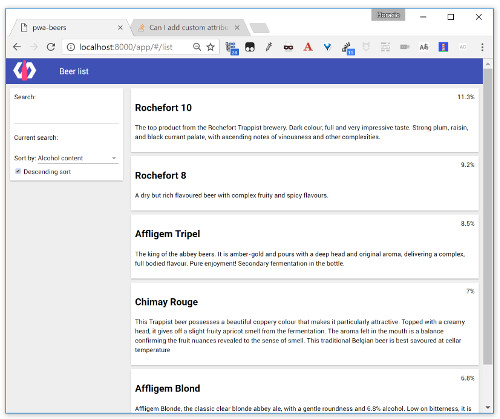

#  PWA Beers - Step 05 - Sorting the list

> This is an optional step, that helps you dive deeper into Polymer. If your main interest in *PWA Beers* is the PWA aspect, you can simply copy the content of the `step-05` folder into your working folder `app`.

In this step, you will add a feature to let your users control the order of the items in the beer list. The dynamic ordering is implemented by creating a new model property, wiring it together with the repeater, and letting the data binding magic do the rest of the work.

In addition to the search box, the app displays a drop down menu that allows users to control the order in which the beers are listed.


## Adding some more beers

To better see the filtering and sorting capabilities, let's add some more beers to our model:

```javascript
this.beers = [
  {
    "alcohol": 6.8,
    "name": "Affligem Blond",
    "description": "Affligem Blonde, the classic clear blonde abbey ale, with a gentle roundness and 6.8% alcohol. Low on bitterness, it is eminently drinkable."
  },
  {
    "alcohol": 8.5,
    "name": "Affligem Tripel",
    "description": "The king of the abbey beers. It is amber-gold and pours with a deep head and original aroma, delivering a complex, full bodied flavour. Pure enjoyment! Secondary fermentation in the bottle."
  },
  {
    "alcohol": 9.2,
    "name": "Rochefort 8",
    "description": "A dry but rich flavoured beer with complex fruity and spicy flavours."
  },
  {
    "alcohol": 11.3,
    "name": "Rochefort 10",
    "description": "The top product from the Rochefort Trappist brewery. Dark colour, full and very impressive taste. Strong plum, raisin, and black currant palate, with ascending notes of vinousness and other complexities."
  },
  {
    "alcohol": 7,
    "name": "Chimay Rouge",
    "description": "This Trappist beer possesses a beautiful coppery colour that makes it particularly attractive. Topped with a creamy head, it gives off a slight fruity apricot smell from the fermentation. The aroma felt in the mouth is a balance confirming the fruit nuances revealed to the sense of smell. This traditional Belgian beer is best savoured at cellar temperature "
  }
];
```  


## Sorting beers by alcohol content

We add a `sort` attribute to the `dom-repeat` repeater, in a similar way as we did with filter, to declare a sorting function

```html
<dom-repeat  id="beerList" items="{{beers}}"  filter="[[computeBeerFilter(filterText)]]" sort="beerSorter">
  <template>
    <beer-list-item name="{{item.name}}" description="{{item.description}}">
    </beer-list-item>
  </template>
</dom-repeat>
```

And we define our sorting function:

```javascript
  beerSorter(a, b) {
    if (a.alcohol === b.alcohol) return 0;
    return b.alcohol - a.alcohol;
  }
```

So now we have our beers ordered by alcohol content. But let's do a more flexible order function...


## Selecting order criteria

First we add the [`paper-dropdown-menu`](https://www.webcomponents.org/element/PolymerElements/paper-dropdown-menu), [`paper-listbox`](https://www.webcomponents.org/element/polymerelements/paper-listbox) and [`paper-item`](https://www.webcomponents.org/element/PolymerElements/paper-item) element to do a nice Material Design dropdown menu.

```
bower install --save PolymerElements/paper-dropdown-menu PolymerElements/paper-listbox PolymerElements/paper-item
```

```json
{
  "name": "pwa-beers",
  "description": "PWA Beers with Polymer 2.x",
  "main": "index.html",
  "dependencies": {
    "polymer": "Polymer/polymer#^2.0.0",
    "app-route": "PolymerElements/app-route#^2.0.0",
    "iron-pages": "PolymerElements/iron-pages#^2.0.0",
    "iron-selector": "PolymerElements/iron-selector#^2.0.0",
    "paper-toolbar": "PolymerElements/paper-toolbar#^2.0.0",
    "paper-material": "PolymerElements/paper-material#^2.0.0",
    "iron-flex-layout": "PolymerElements/iron-flex-layout#^2.0.0",
    "paper-input": "PolymerElements/paper-input#^2.0.0",
    "paper-dropdown-menu": "PolymerElements/paper-dropdown-menu#^2.0.0",
    "paper-listbox": "PolymerElements/paper-listbox#^2.0.0",
    "paper-item": "PolymerElements/paper-item#^2.0.0"
  },
  "devDependencies": {
    "web-component-tester": "Polymer/web-component-tester#^6.0.0",
    "webcomponentsjs": "webcomponents/webcomponentsjs#^1.0.0"
  }
}
```

We import `paper-dropdown-menu.html` in our `beer-list` element, and we add a `paper-dropdown-menu` named `orderProp`, so that our users can pick from the two provided sorting options.

```html
<paper-material class="sidebar">
  <!--Sidebar content-->
  <div>Search: <paper-input value="{{filterText}}"></paper-input></div>
  <div>Current search:</div>
  <div>{{filterText}}</div>
  <div>  
    Sort by:
    <paper-dropdown-menu selected-item="{{criterion}}">
      <paper-listbox slot="dropdown-content" selected="0">
        <dom-repeat items="{{criteria}}">
          <template>
            <paper-item data-name="[[item.dataName]]">[[item.label]]</paper-item>
          </template>
        </dom-repeat>
      </paper-listbox>
    </paper-dropdown-menu>
  </div>        
</paper-material>
```

```javascript
criteria: {
  type: Array,
  value: function() { 
    return [
      { dataName: "name", label: "Alphabetical"},
      { dataName: "alcohol", label: "Alcohol content" }
    ];
  }
}
```

Then we modify the sort function to make it dynamic, in a similar way we did in last step for the filter:

```html
<dom-repeat  id="beerList" items="{{beers}}"  filter="[[computeBeerFilter(filterText)]]" sort="[[computeBeerSorter(criterion)]]">
  <template>
    <beer-list-item name="{{item.name}}" description="{{item.description}}">
    </beer-list-item>
  </template>
</dom-repeat>
```

```javascript
computeBeerSorter(criterion) {
  console.log('computeBeerSorter')
  return function(a,b){
    if (!criterion) return 0;
    if ( a[criterion.dataName] === b[criterion.dataName] ) return 0;
    if ( a[criterion.dataName] < b[criterion.dataName] ) return -1;
    if ( a[criterion.dataName] > b[criterion.dataName] ) return 1; 
  }
}
```


## Ascending or descending

By default our sorter sorts in ascending order. Let's add a checkbox to give us descending sort capabilities.

We could use an specific paper element, like [`paper-checkbox`](https://www.webcomponents.org/element/PolymerElements/paper-checkbox), but we are going to use a simple HTML input, to see how to do it. We need to link the `descendingSort` input field to a property of the object. In the template we use checked to link the `change` event of the `input` item to the `descendingSort` property:

```html
  <paper-material class="sidebar">
    <!--Sidebar content-->
    <div>Search: <paper-input value="{{filterText}}"></paper-input></div>
    <div>Current search:</div>
    <div>{{filterText}}</div>
    <div>  
      Sort by:
      <paper-dropdown-menu selected-item="{{criterion}}">
        <paper-listbox class="dropdown-content"  selected="0">
          <template is="dom-repeat" items="{{criteria}}">
            <paper-item data-name="[[item.dataName]]">[[item.label]]</paper-item>
          </template>
        </paper-listbox>
      </paper-dropdown-menu>
    </div>             
    <div>
      <input type="checkbox" checked="{{descendingSort::change}}" name="sortingOrder">
      Descending sort
    </div>   
  </paper-material>
```

```javascript
  descendingSort: {
    type: Boolean,
    value: false
  }
```

We modify the template repeater to make sorting also dependant of `descendingSort`:

```
<dom-repeat  id="beerList" items="{{beers}}"  filter="[[computeBeerFilter(filterText)]]" sort="[[computeBeerSorter(criterion, descendingSort)]]">
  <template>
    <beer-list-item name="{{item.name}}" description="{{item.description}}">
    </beer-list-item>
  </template>
</dom-repeat>
```

And then we modify the sort to inverse the order if the `descendingSort` property is true:

```javascript
computeBeerSorter(criterion, descendingSort) {
  console.log('computeBeerSorter')
  return function(a,b){
    if (!criterion) return 0;
    var invert = 1;
    if (descendingSort) invert = -1;
    if ( a[criterion.dataName] === b[criterion.dataName] ) return 0;
    if ( a[criterion.dataName] < b[criterion.dataName] ) return -1*invert;
    if ( a[criterion.dataName] > b[criterion.dataName] ) return 1*invert; 
  }
}
```

[](../img/step-05_01.jpg)

## Next

Now that you have added list sorting, go to [step 06](../step-06) to learn how to dynamically load our beer data from a server-side JSON file.
