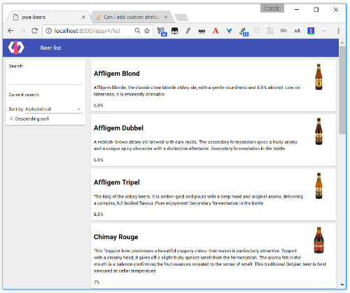

#  PWA Beers - Step 06 - Doing some AJAX

> This is an optional step, that helps you dive deeper into Polymer. If your main interest in *PWA Beers* is the PWA aspect, you can simply copy the content of the `step-05` folder into your working folder `app`.

Enough of building an app with five beers in a hard-coded dataset! Let's fetch a larger dataset from our server using one of [Polymer iron elements](https://www.webcomponents.org/collection/PolymerElements/iron-elements) called [`iron-ajax`](https://www.webcomponents.org/element/PolymerElements/iron-ajax).

## Data

Our new dataset is now a list of 11 beers stored in JSON format in the `data/beers/beers.json`, available to your browser at the URL `http://127.0.0.1:8000/data/beers/beers.json`.

`data/beers/beers.json`:

```json
[
  [...]
  {
    "alcohol": 6.8,
    "description": "A reddish-brown abbey ale brewed with dark malts. The secondary fermentation gives a fruity aroma and a unique spicy character with a distinctive aftertaste. Secondary fermentation in the bottle.",
    "id": "AffligemDubbel",
    "img": "beers/img/AffligemDubbel.jpg",
    "name": "Affligem Dubbel"
  },
  [...]
]
```

## `iron-ajax` element

We will use the `iron-ajax` to make an HTTP request to your web server to fetch the data in the `app/beers/beers.json` file.

`iron-ajax` is one of the elements in the [Polymer iron elements](https://www.webcomponents.org/collection/PolymerElements/iron-elements) collection, a set of visual and non-visual utility elements. They include elements for working with layout, user input, selection, and scaffolding apps.

`iron-ajax` makes an HTTP GET request to our web server, asking for `/data/beers/beers.json`. The server responds by providing the data in the JSON file. (The response might just as well have been dynamically generated by a backend server. To the browser and our app they both look the same. For the sake of simplicity we used a JSON file in this tutorial.)

To use `iron-ajax` in our application we need:

1. Installing the dependency with bower

  ```
  bower install --save PolymerElements/iron-ajax
  ```

  So our `bower.json` should be like:

  ```json
  {
    "name": "pwa-beers",
    "description": "PWA Beers with Polymer 2.x",
    "main": "index.html",
    "dependencies": {
      "polymer": "Polymer/polymer#^2.0.0",
      "app-route": "PolymerElements/app-route#^2.0.0",
      "iron-pages": "PolymerElements/iron-pages#^2.0.0",
      "iron-selector": "PolymerElements/iron-selector#^2.0.0",
      "paper-toolbar": "PolymerElements/paper-toolbar#^2.0.0",
      "paper-material": "PolymerElements/paper-material#^2.0.0",
      "iron-flex-layout": "PolymerElements/iron-flex-layout#^2.0.0",
      "paper-input": "PolymerElements/paper-input#^2.0.0",
      "paper-dropdown-menu": "PolymerElements/paper-dropdown-menu#^2.0.0",
      "paper-listbox": "PolymerElements/paper-listbox#^2.0.0",
      "paper-item": "PolymerElements/paper-item#^2.0.0",
      "iron-ajax": "PolymerElements/iron-ajax#^2.0.2"
    },
    "devDependencies": {
      "web-component-tester": "Polymer/web-component-tester#^6.0.0",
      "webcomponentsjs": "webcomponents/webcomponentsjs#^1.0.0"
    }
  }
  ```


1. Import `iron-ajax` in `beer-list`

  ```html
  <!-- Import iron-ajax to get the list of beers from the server -->
  <link rel="import" href="../../bower_components/iron-ajax/iron-ajax.html">
  ```

  Then we can place an `iron-ajax` element in `beer-list` to request the beer list to the server:

  ```html
    <iron-ajax
      auto
      url="/data/beers/beers.json"
      params='{}'
      handle-as="json"
      on-response="gotBeers"
      on-error="gotError"
      debounce-duration="300"></iron-ajax>
  ```

In the `on-response` attribute we define what callback function will be called when the data is collected.
We use that callback function to initialize the beers object.

The callback has two parameters, an event object that has all the information about the request life, and a [`iron-request`](https://www.webcomponents.org/element/PolymerElements/iron-ajax/elements/iron-request) object, where we can call the `response` property to get directly the response data.  

```javascript
gotBeers(event, ironRequest) {
  this.beers = ironRequest.response;
}
```

You can see all the details on using `iron-ajax` on its [documentation page](https://www.webcomponents.org/element/PolymerElements/iron-ajax).

## Showing more information

As now we recover more information for each beer (an id and an image URL), we are going to modify `beer-list-item` element to show it.

We begin by adding the missing properties:

```javascript
static get properties() {
  return {
    id: {
      type: String,
      value: ""
    },
    name: {
      type: String,
      value: ""
    },
    description: {
      type: String,
      value: ""
    },
    img: {
      type: String,
      value: ""
    },
    alcohol: {
      type: Number,
      value: 0
    }
  }
}
```

Then we modify the template:

```html
  <template>
    <paper-material class="beer">
      
      <h2 class="name">[[name]]</h2>
      <p class="description">[[description]]</p>
      <div class="alcohol">[[alcohol]]%</div>
    </paper-material>
  </template>
```

And we add some CSS to make things prettier:

```css
  <style>
    .beer {
      margin: 10px;
      padding: 10px;
      background-color: white;
      min-height: 50px;
    }
    .alcohol {
      clear:both;
    }
    .img {
      float: right;
      width: 100px;
      max-height: 100px;
    }
  </style>
```

We also need to modify `beer-list` in order to pass the new information each `beer-list-item`:

```html
<beer-list-item id="[[item.id]]" name="[[item.name]]" description="[[item.description]]" img="[[item.img]]" alcohol="[[item.alcohol]]"></beer-list-item>
```

[](../img/step-06_01.jpg)  


## Next

Now that you have loaded beer data from a server-side JSON file, go to [step 7](../step-07) to learn how to add the details of each beer.
