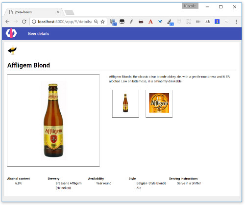

#  PWA Beers - Step 07 - Beer details

What if we wanted to show more details about a beer when we click on it? We can imagine opening another panel with the detailed information.

We have already used `app-route` and `app-location` in [step-01](./step-01/). In our application, they are used in combination with an `iron-pages` element that displays the right page.

Now we want to be able to choose a beer from the list and display its details. We need to modify the routing system:

- `list`: the list of beers
- `details/<ID>`: the details of the beer with id `<ID>`


## `beer-details`

Let's begin by creating a `beer-details` element, that calls to a *beer details* service (or in these case, a set of *beer details* JSON files) to recover and show more information on the chosen beer.


The template includes more beer properties, found in the detailed JSON file for each beer.
The *iron-ajax* calls the file according to the beer id.


```html
<link rel="import" href="../../bower_components/iron-ajax/iron-ajax.html">

<link rel="import" href="/bower_components/paper-material/paper-material.html">

<dom-module id="beer-details">
  <template>
    <style>
      [...]
    </style>

    <paper-material id="{{beer.id}}" class="beer">
      <a href="#/beers"></a>
      <h1 class="name">{{beer.name}}</h1>
      
      <p class="description">{{beer.description}}</p>

      <ul class="beer-thumbs">
        <li>
          
        </li>
        <li>
          
        </li>
      </ul>
      <ul class="specs">
        <li>
          <dl>
            <dt>Alcohol content</dt>
            <dd>{{beer.alcohol}}%</dd>
          </dl>
        </li>
        [...]
      </ul>
    </paper-material>
    <iron-ajax
      auto
      url="{{url}}"
      method='get'
      params='{}'
      handle-as="json"
      on-response="gotBeers"
      debounce-duration="300"></iron-ajax>
  </template>

  <script>
    /**
     * @customElement
     * @polymer
     */
    class BeerDetails extends Polymer.Element {
      static get is() { 
        return 'beer-details'; 
      }

      static get properties() {
        return {
          id: {
            type: String,
            value: ""
          },
          url: {
            type: String,
            computed: "getUrl(id)"
          }
        }
      } 
      
      getUrl(id) {
        console.debug("getUrl", id)
        return "../../data/beers/details/"+id+".json";
      }
      
      gotBeers(event, ironRequest) {
        this.beer = ironRequest.response;
        console.log("Beer", this.beer)
        this.mainImg = this.beer.img;
      }

      setImage(evt) {
        this.mainImg = evt.srcElement.beer;
      }    
    }

    window.customElements.define(BeerDetails.is, BeerDetails);
  </script>
</dom-module>
```

## Routing

In `./src/pwa-beers-app/pwa-beers-app.html` we are adding a new instance of `app-route` to listen to the `/details` path and capture the id of the beer:

```html
<app-route route="{{route}}" pattern="/details/:id" data="{{detailsData}}"></app-route>
```

Then we import `beer-details.html`:

```html
<link rel="import" href="../beer-details/beer-details.html">
```  

And we call `beer-details` inside `iron-pages`:

```html
    <iron-pages selected="[[page]]" attr-for-selected="name" fallback-selection="lost">
      <div name="list">
        <paper-toolbar>
          <div class="logo"></div>
          <div class="title">Beer list</div>
        </paper-toolbar>     
        <beer-list></beer-list>
      </div>
      <div name="details">        
        <paper-toolbar>
          <div class="logo"></div>
          <div class="title">Beer details</div>
        </paper-toolbar>  
        <beer-details id="[[detailsData.id]]"></beer-details>   
      </div>
      <div name="lost"><h1>It`s seem I'm lost...</h1></div>
    </iron-pages>
```

## Hyperlinking the beers

In order to get the details on a beer when we click on its name, we need to put the name inside a `<a>` tag that will send us to the route corresponding to that beer.

So we define a `url` computed property in our element:

```javascript
static get properties() {
  return {
    [...]
    url: {
      type: String,
      computed: "getUrl(id)"
    }
  }
}
[...]
getUrl(id) {
  return "#/details/"+id
}
```

And then we use this property in the hyperlink element:

```javascript
<dom-module id="beer-list-item">
  <template>
    <style>
      [...]
    </style>
    <paper-material class="beer">
      
      <a href="{{url}}"><h2 class="name">[[name]]</h2></a>
      <p class="description">[[description]]</p>
      <div class="alcohol">[[alcohol]]%</div>
    </paper-material>
  </template>
</dom-module>
```

[](../img/step-07_01.jpg)  
