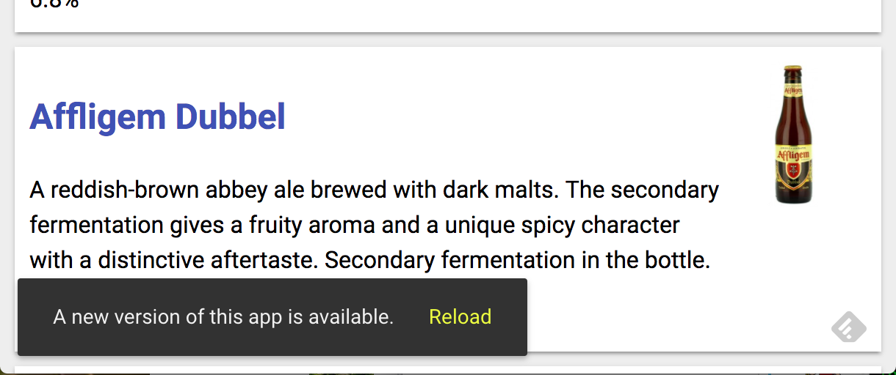

# Step 09 - Manage the offline state

In this step we will manage the offline state of our webapp.

```
cd step-09
ln -sfn ../data .
ln -sfn ../bower_components .
polymer build
polymer serve -p 5000 build/bundled
```

## Detect service-worker update

When updating the application, the service-worker is rebuild. When the user
reload the application, the new service-worker is loaded but is still inactive
until the page is reload.



It's a good practice to advertise the user of the new application version.

```javascript
if (navigator.serviceWorker && navigator.serviceWorker.controller) {
  navigator.serviceWorker.controller.onstatechange = function(event) {
    if (event.target.state === 'redundant') {
      var tapHandler = function() {
        window.location.reload();
      };
      console.log('service worker updated');
      if (document.querySelector("pwa-app")) {
        var evt = new CustomEvent('notify', {
          detail: {
            message: 'A new version of this app is available.',
            duration: 0,
          }
        });
        document.querySelector("pwa-app").dispatchEvent(evt);
      }
    }
  };
}
```

adding this script to the index.html file, will raise an event when the application is updated.

Add a listener to the app to react to the notify event.

```javascript
listeners: {
  'notify': '_notifyUser',
},

_notifyUser: function(event) {
  var options = event.detail;
  this.$.toast.text = options.message;
  this.$.toast.duration = options.duration == null ? 5000 : options.duration;
  this.$.toastButton.hidden = false;
  this.$.toast.open();
},

_reload: function() {
  window.location.reload();
},
```

And add a paper-toast into the template of the app.

```html
<paper-toast id='toast'>
  <paper-button on-tap="_reload" class="yellow-button" id='toastButton' hidden>Reload</paper-button>
</paper-toast>
```

## Detect the offline state

It is good practice to respond to an offline event to prevent the use of some degraded behaviors.

to do so, the application should listen to the 'offline' and 'online' event emitted by the window object.

```javascript
ready: function() {
  // listen for online/offline
  this._notifyNetworkStatus()
  Polymer.RenderStatus.afterNextRender(this, function() {
    this.listen(window, 'online', '_notifyNetworkStatus');
    this.listen(window, 'offline', '_notifyNetworkStatus');
  });
},

_notifyNetworkStatus: function(event) {
  var options = (event && event.detail) || {};
  var oldOffline = this.offline;
  this.offline = !navigator.onLine;
  this.$.toolbar.style.background = this.offline ? 'dimgray' : '';

  if (event && (this.offline || (!this.offline && oldOffline === true))) {
    this.$.toastButton.hidden = true;
    this.$.toast.text = this.offline ? 'You are offline' : 'You are online';
    this.$.toast.duration = options.duration == null ? 5000 : options.duration;
    this.$.toast.open();
  }
},
```


you will also transmit the offline state to sub components.

for example :

```html
<beer-details id$="[[detailsData.id]]" offline$="[[offline]]"></beer-details>
```

in the detail view, we will display a warning, when offline and when the detail could not be downloaded.


we create a new component beer-internet-warn :

```html
<link rel="import" href="../bower_components/polymer/polymer.html">

<dom-module id="beer-internet-warn">
  <template>
    <style>
    :host {
      display: block;
      padding: 40px 20px;
      text-align: center;
    }
    button {
      border: 2px solid black;
      background: white;
      font-size: inherit;
      margin: 30px 0px;
    }
    </style>
    <div hidden$="[[!offline]]">
      No Internet connection
    </div>
    <button on-tap='_reconnect'>Try again</button>
  </template>

  <script>
    Polymer({
      is: 'beer-internet-warn',

      properties: {
        offline: Boolean,
      },

      _reconnect: function() {
        window.location.reload();
      },
    });
  </script>
</dom-module>
```

and in the beer-details component, we add some bahaviors to react to the offline event.

we add 2 new properties :

```javascript
offline: {
  type: Boolean,
  value: false,
},
failure: {
  type: Boolean,
  value: false,
},
```

the offline property indicates that the application is offline, and the failure property indicates that the detail have not be downloaded.

to detect the failure, we add a observer method on error to the iron-ajax component.

```html
<iron-ajax
  auto
  url="{{url}}"
  method='get'
  params='{}'
  handle-as="json"
  on-response="gotBeers"
  on-error="_error"
  debounce-duration="300"></iron-ajax>
<beer-internet-warn offline="[[offline]]" hidden="[[!failure]]"></beer-internet-warn>
```

```javascript
_error: function(event) {
  this.failure = true;
}
```

and we embrace the code of the detail view into a div, hidden when failure is true.

```html
<div hidden=[[failure]]>
  <h1 class="name">{{beer.name}}</h1>
  
  <p class="description">{{beer.description}}</p>
  <ul class="beer-thumbs">
    <li>
  ...
</div>
```
